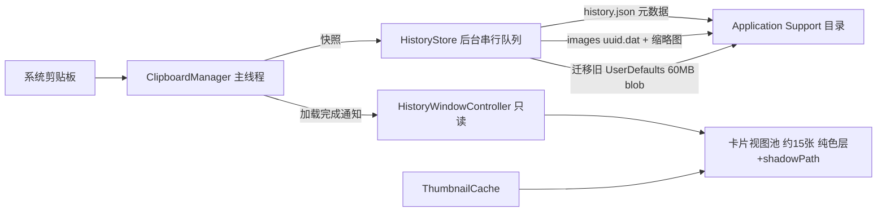

## 背景与现象

打开剪贴板历史窗口后滚动或用鼠标在列表上移动时，指针与滚动明显延迟；最严重的是刚打开后的 1~10 秒，且指针只在压在列表上方时明显。已实测确认瓶颈是窗口合成：历史窗口打开并交互时 App 自身 CPU 峰值仅 17.8%，而 WindowServer 从基线 5~28% 冲到 85%，GPU 从 0~22% 冲到约 50%；指针离开窗口立刻回落到 24.9%~12.4%。

## 需求目标

在不改变现有交互与视觉基调的前提下，消除历史窗口的合成/主线程开销，使打开与滚动不再产生可感知的指针延迟。

## 核心功能

- 卡片视图池复用：窗口内只保留约 15 张可见卡片视图，滚动时复用并只更新内容，不再一次性创建 200 张（改前实测 227 ms、1200 个子视图）。
- 卡片背景去掉实时毛玻璃：200 个 `NSVisualEffectView`（`.withinWindow` 实时 backdrop）全部改为半透明纯色层，卡片仍为圆角、浅色描边、带阴影的深色半透明质感，选中态改用加深背景 + 蓝色描边表达。
- 消除窗口级重合成：关闭非不透明全宽窗口的系统阴影（`hasShadow = false`），保留窗口底层那层全宽毛玻璃背景与「历史窗口背景透明度」滑块。
- 渲染成本削减：卡片阴影改用 `shadowPath`；图片先降采样成缩略图再当 `layer.contents`（改前原分辨率，合计 10.3 Mpx 约 39 MB 纹理）；预览文本截断并限制行数（改前最长 7005 字全量 wrap 布局）；时间格式复用 formatter。
- 历史存储重构：历史与图片从 UserDefaults 的单个 60 MB blob 迁到独立文件（元数据 JSON + 图片独立文件），编解码与缩略图生成走后台队列，打开与保存都不阻塞主线程（改前解码实测 914 ms），旧数据自动迁移并在校验通过后清除旧 key。

## 视觉与交互保持不变

窗口仍无边框、贴屏幕底部、宽度 100%、高度 20%、跟随鼠标所在屏幕、毛玻璃背景；卡片尺寸/间距/顺序不变；点击卡片即粘贴（仍按坐标命中）、方向键选择并自动滚到可见区、Enter/空格粘贴、Backspace/Delete 删除、竖向滚轮转横向、锁 Y 轴、弹性滚动、空白处点击关闭、Esc 关闭并恢复原焦点；两个透明度滑块实时生效。

## 技术栈

沿用现有栈，不引入任何依赖：Swift（AppKit / Core Animation / ImageIO）+ `swiftc -O` 直编（`build.sh`，`-target arm64-apple-macosx13.0`），无 Xcode 工程、无第三方库；新增源文件必须加入 `build.sh` 的 `SRC_FILES`。沿用现有单向数据流：`ClipboardManager.history` 是唯一数据源，UI 只读不写。

## 实施策略与关键决策

### 1. 卡片视图池（替代一次性创建 200 张）

- 池容量 = `ceil(窗口宽 / (180 + 10)) + 2`（本机 1728 pt 宽约 12~14 张），首次 `showWindow` 只建这么多。
- 池中每张卡片新增 `index` 标记；卡片 frame 由它当前代表的 index 反算：`x = leftPadding + CGFloat(index) * (itemWidth + itemSpacing)`，因此**卡片在容器中的位置与其 index 始终一致**，`itemAtWindowPoint`（按 `frame.contains` 从后往前找）与 `scrollToItem`（按 index 算 x）都不需要改变语义，彻底规避「点 A 贴 B」。
- 滚动时按 clip 可见矩形算出可见 index 区间（含前后各 1 张缓冲），把区间内的 index 分配给池视图：复用已有 index 的视图不动，空缺的 index 用「当前未被使用的池视图」重新配置并移动 frame；仍在区间内但内容失效的（如删除后）重新配置。
- `containerView` 宽度仍按 `leftPadding + count*(w+s) + leftPadding` 计算，滚动范围、弹性与文档宽度不变。
- 触发重建的入口：打开窗口、删除当前项、外观设置变更、历史加载完成。复杂度从每帧 O(200) 次视图更新降为 O(可见数)。

### 2. 卡片背景：实时毛玻璃改半透明纯色层

- `ClipboardItemView` 的背景由 `PassthroughVisualEffectView`（`.withinWindow`）换成普通 layer 背景：圆角 10、1px 浅色描边、颜色为中性半透明（浅色叠加，色值实现时按截图与现版本对比微调），alpha 由 `AppearanceSettings.cardBackgroundAlpha` 线性映射，保证滑块照旧生效。
- 卡片阴影保留视觉但改设 `layer.shadowPath`（圆角矩形路径按卡片尺寸生成一次复用），避免 Core Animation 按层内容 alpha 现算阴影。
- 选中态不再切换 `NSVisualEffectView.material`，改为调 `layer.backgroundColor`（略微提亮）+ 蓝色描边（`systemBlue`，宽 1.5）—— 选中反馈视觉等价，且零合成代价。

### 3. 窗口层：仅去掉系统阴影

- `window.hasShadow = false`（非不透明 + 全宽 + 内容每帧变化时，窗口阴影会被反复重算）；`isOpaque = false`、`backgroundColor = .clear`、`level = .floating`、`collectionBehavior`、底层 `.behindWindow` + `.hudWindow` 毛玻璃与 `historyBackgroundAlpha` 全部保留。

### 4. 图片与文本

- 图片：新增缩略图缓存，用 ImageIO（`CGImageSourceCreateThumbnailAtIndex` + `kCGImageSourceThumbnailMaxPixelSize`，目标约 2 倍卡片尺寸）按需生成并缓存到内存（按 item id），赋给 `layer.contents` 并设 `contentsScale`；原图数据保持原样用于「复制回剪贴板」。避免滚动复用同一张卡片时反复解码大图。
- 文本：新增 `previewTextForDisplay`（`prefix(约 400 字)`）供卡片显示，预览标签 `maximumNumberOfLines` 从 0 改为固定值（如 6）；`displayText`/标题截断逻辑不变。`formattedTime` 复用静态 `DateFormatter`。

### 5. 历史存储重构（文件存储 + 后台编解码 + 迁移）

- 新增 `HistoryStore`：目录 `~/Library/Application Support/剪贴板历史/`，`history.json` 只存元数据（id/timestamp/type/text/urlString/fileURLs/imageFileName），图片原图存 `images/<uuid>.dat`。元数据 JSON 只有几十 KB，解码从 914 ms 降到毫秒级。
- `ClipboardItem` 增加 `imageFileName`，`imageData` 改为「按需从 store 读取并缓存」的访问器（由 `ClipboardManager` 在加载后注入 loader），使 `copyToClipboard`、去重比较等现有调用点无需改动语义，同时不再把 30 MB 图片常驻内存/JSON。
- 读写线程模型：主线程只负责生成快照与更新 `history`（保持单向数据流）；`HistoryStore.save` 在串行后台队列上做 JSON 编码、图片落盘与写盘合并（同一轮多次变更只落一次盘），`deleteItem`/`clearHistory` 同步清理对应图片文件；读取在队列上完成后回主线程提交并广播 `.clipboardHistoryDidLoad`，窗口若已打开则重建池。
- 迁移（幂等、不可丢数据）：检测旧 `UserDefaults["clipboardHistory"]` blob 存在时，后台解码并全量写入新存储，回读校验条数与 id 集合一致后，再删除旧 key 并落标记 `hasMigratedHistoryStoreV2`；任一步失败则保留旧数据不影响启动。

## 性能与复杂度

- 单帧：从「遍历 200 张卡片」降为「约 15 张卡片的 frame/内容更新」，且每张卡片从「实时 backdrop 毛玻璃 + 现算阴影」降为「一个纯色 layer + 预生成 shadowPath」，WindowServer/GPU 每帧重合成量与图层数大幅下降，预期指针延迟消失（验收目标：打开并压在列表上时 WindowServer 不再冲到 80% 以上）。
- 打开：主线程不再有 227 ms 建卡 + 图片解码；历史加载改为后台（毫秒级元数据解码 + 图片懒加载）。
- 保存：60 MB 编码移出主线程，避免 1 秒级卡死。
- 内存：常驻历史不再把全部图片 base64 放在 UserDefaults/内存，改为按需读取 + 缩略图缓存（可设上限）。

## 实施注意（防回归）

- 改动集中在 `HistoryWindowController` 与存储层，不动 `FanControl` / `main.swift` / `--fanctl` / 风扇巡检逻辑，也不动快捷键（Carbon 热键）与 `AppDelegate` 的窗口开关语义。
- `showWindow(_:previousActiveApp:)` 签名与 `AppDelegate` 调用点保持不变；`itemAtWindowPoint` 的坐标命中逻辑与「点 A 贴 B」修复必须保留。
- 池化后任何「条数变化」都必须重置池（删除、清空、加载完成），否则会出现残留卡片或索引错位；`applyAppearanceSettings` 只遍历池即可。
- 迁移期间本机就是生产数据：先写后校验再删，且迁移在后台执行，不阻塞窗口与菜单栏交互。
- 本项目零依赖 `swiftc` 直编：新增文件必须同步加入 `build.sh` 的 `SRC_FILES`。

## 架构与数据流



## 目录结构

本次为现有项目改造，仅列受影响文件：

```
mac剪贴板/
├── ClipboardHistory/Sources/
│   ├── HistoryWindowController.swift  # [MODIFY] 窗口改为 hasShadow=false；updateItemViews 替换为「卡片视图池」重建/刷新（按可见 index 区间分配池视图、按 index 反算 frame）；scrollToItem 改为按 index 数学计算；删除项后重置池；ClipboardItemView 增加 index 标记、背景改半透明纯色 layer（alpha 取 cardBackgroundAlpha）、阴影设 shadowPath、setSelected 改用 layer 背景色+蓝色描边、图片改取缩略图、预览文本用截断版并限制行数；移除已无引用的 PassthroughVisualEffectView
│   ├── ClipboardManager.swift         # [MODIFY] loadHistory/saveHistory 改走 HistoryStore 并在后台队列编解码；启动时先异步加载再提交并在主线程广播 .clipboardHistoryDidLoad；deleteItem/clearHistory 同步清理图片文件；对外 API（history/copyToClipboard/snapshotPasteboard/restorePasteboard/startMonitoring/stopMonitoring）签名与语义保持不变
│   ├── ClipboardItem.swift            # [MODIFY] 增加 imageFileName；imageData 改为经注入 loader 按需读取并缓存；新增 previewTextForDisplay（截断）与复用静态 DateFormatter 的 formattedTime；type/去重/icon 逻辑不变
│   ├── HistoryStore.swift             # [NEW] 文件化持久化：元数据 history.json + images/uuid.dat 的读写删、串行后台队列与写盘合并、旧 UserDefaults blob 的幂等迁移（回读校验后删旧 key 并落标记）、对外提供 loadSaveDeleteClear 与 imageData(for:)
│   ├── ThumbnailCache.swift           # [NEW] 用 ImageIO 生成并缓存缩略图（按 item id，目标约 2 倍卡片尺寸），返回 CGImage 供 layer.contents 使用，含缓存上限与清理
│   └── AppDelegate.swift              # [MODIFY] 仅接线：初始 history 为空时窗口仍可打开；订阅 .clipboardHistoryDidLoad 在窗口已打开时刷新内容（其余菜单/快捷键/权限逻辑不动）
└── build.sh                           # [MODIFY] SRC_FILES 增加 HistoryStore.swift 与 ThumbnailCache.swift
```

## 关键结构（接口级）

```
// ClipboardItem 的图片按需访问（避免 60MB 常驻）
final class ClipboardItem {
    var imageFileName: String?
    var imageDataLoader: ((String) -> Data?)?   // 由 ClipboardManager/HistoryStore 注入
    var imageData: Data? { get }                // 首次访问时经 loader 读取并缓存
    var previewTextForDisplay: String { get }   // 截断后的卡片预览文本
}

// 历史持久化（后台串行队列；主线程只交快照）
final class HistoryStore {
    func load(completion: @escaping ([ClipboardItem]) -> Void)     // 后台读元数据，回主线程提交
    func save(_ snapshot: [ClipboardItem])                          // 后台编码并合并落盘
    func removeImage(fileName: String)
    func clear()
    func imageData(fileName: String) -> Data?
    func migrateFromUserDefaultsIfNeeded(completion: @escaping () -> Void)
}
```

## Agent Extensions

### SubAgent

- **code-explorer**
- Purpose: 在动手前把所有「隐含依赖」查清，避免重构漏改：

    1. 列出全部把 `itemViews` 与 `items` 当作一一对应的地方（`itemAtWindowPoint`、`scrollToItem`、`deleteItem`、`applyAppearanceSettings`、`showWindow`），输出文件与行号清单；
    2. 列出 `ClipboardItem.imageData`、`ClipboardManager.history`、`saveHistory`、`loadHistory` 的全量消费点（含 `AppDelegate`、`FanControl` 等），确认图片懒加载与异步加载不会破坏既有调用。

- Expected outcome: 一份精确的调用点清单（文件 + 行号 + 用途），作为池化与存储重构的改动边界依据。

### Skill

- **lsp-code-analysis**
- Purpose: 在重构收尾时做符号级校验：确认 `PassthroughVisualEffectView`、`updateItemViews`、基于 `material` 的选中逻辑已无残留引用，`ClipboardItemView.index` 等新符号的引用/定义一致。
- Expected outcome: 零悬空引用的确认（无剩余引用报告），保证 `swiftc -O` 一次编译通过。

### MCP

- **Xcode**
- Purpose: 验收阶段用 `run_xcrun` 调 `xcrun xctrace record`（Core Animation / Time Profiler 模板）抓历史窗口打开并滚动时的帧率与热点，作为 WindowServer/GPU 采样之外的客观佐证。
- Expected outcome: 一份可对比的帧率/热点数据，证明修复后不再掉帧、主线程无百毫秒级阻塞。